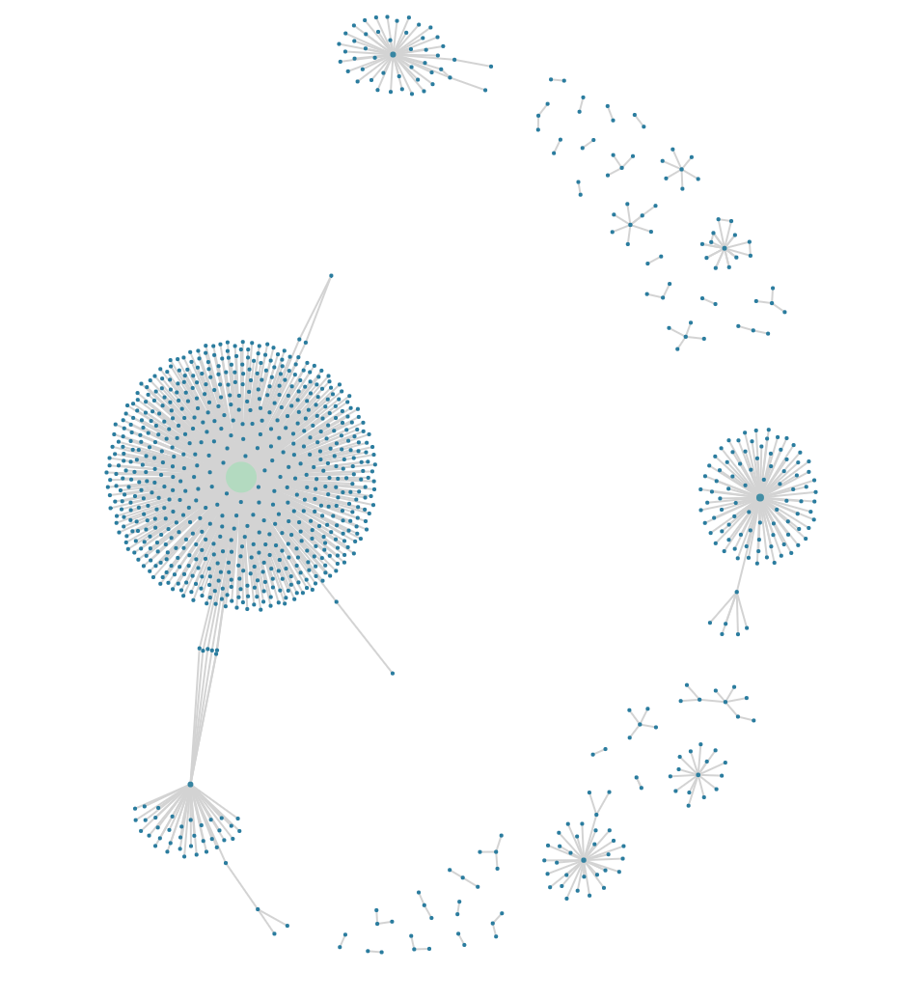

<!-- README.md is generated from README.Rmd. Please edit that file -->

<!-- badges: start -->

[](https://travis-ci.org/news-r/hoaxy)
[](https://ci.appveyor.com/project/news-r/hoaxy)
<!-- badges: end -->

# hoaxy

[Hoaxy](https://rapidapi.com/truthy/api/hoaxy) visualizes the spread of
claims and related fact checking online. A claim may be a fake news
article, hoax, rumor, conspiracy theory, satire, or even an accurate
report. Anyone can use Hoaxy to explore how claims spread across social
media. You can select any matching fact-checking articles to observe how
those spread as well.

## Installation

``` r
# install.packages("remotes")
remotes::install_github("news-r/hoaxy")
```

## Calls

  - `hx_articles` - Get fake articles on a specific query.
  - `hx_tweets` - Get tweets on specific articles.
  - `hx_edges` - Get network of tweets on specific articles.
  - `hx_timeline` - Get timeline of tweets on specific articles.
  - `hx_spreaders` - Get top Twitter users.
  - `hx_top_articles` - Get top articles.
  - `hx_latest_articles` - Get latest fake news.

## Setup

Create a free account at
[rapidapi.com](https://rapidapi.com/truthy/api/hoaxy) to create an API
key.

``` r
hoaxy_key("xxXXxxXx")
```

Note that you can specify the `RAPIDAPI_API_KEY` key as an environment
variable in your `.Renviron` for convenience.

## Example

Get fake articles.

``` r
library(hoaxy)

(articles <- hx_articles("pizzagate"))
#> # A tibble: 100 x 8
#>    canonical_url date_published domain     id number_of_tweets score
#>    <chr>         <chr>          <chr>   <int>            <int> <dbl>
#>  1 https://www.… 2019-03-16T12… breit… 1.29e6              820  8.91
#>  2 https://www.… 2019-01-29T21… infow… 1.24e6              400  8.91
#>  3 https://www.… 2019-05-21T23… snope… 1.35e6              103  8.31
#>  4 https://www.… 2019-03-17T05… dcclo… 1.29e6              102  5.78
#>  5 https://www.… 2019-06-08T01… infow… 1.36e6               93  9.99
#>  6 https://www.… 2019-04-05T15… polit… 1.31e6               72  4.55
#>  7 https://www.… 2019-01-30T01… snope… 1.24e6               64  3.91
#>  8 https://www.… 2019-04-13T05… dcclo… 1.31e6               59  5.80
#>  9 https://www.… 2019-05-29T10… infow… 1.35e6               50  8.05
#> 10 https://befo… 2019-06-11T16… befor… 1.37e6               46  6.61
#> # … with 90 more rows, and 2 more variables: site_type <chr>, title <chr>
```

Get tweets on some of said articles.

``` r
(tweets <- hx_tweets(articles$id[1:5]))
#> # A tibble: 1,518 x 8
#>    canonical_url date_published domain     id site_type title
#>    <chr>         <chr>          <chr>   <int> <chr>     <chr>
#>  1 https://www.… 2019-01-29T21… infow… 1.24e6 claim     Nutj…
#>  2 https://www.… 2019-01-29T21… infow… 1.24e6 claim     Nutj…
#>  3 https://www.… 2019-01-29T21… infow… 1.24e6 claim     Nutj…
#>  4 https://www.… 2019-01-29T21… infow… 1.24e6 claim     Nutj…
#>  5 https://www.… 2019-01-29T21… infow… 1.24e6 claim     Nutj…
#>  6 https://www.… 2019-01-29T21… infow… 1.24e6 claim     Nutj…
#>  7 https://www.… 2019-01-29T21… infow… 1.24e6 claim     Nutj…
#>  8 https://www.… 2019-01-29T21… infow… 1.24e6 claim     Nutj…
#>  9 https://www.… 2019-01-29T21… infow… 1.24e6 claim     Nutj…
#> 10 https://www.… 2019-01-29T21… infow… 1.24e6 claim     Nutj…
#> # … with 1,508 more rows, and 2 more variables: tweet_created_at <chr>,
#> #   tweet_id <chr>
```

Get network of tweets on articles.

``` r
(edges <- hx_edges(articles$id[1:5]))

plot(edges)
```


